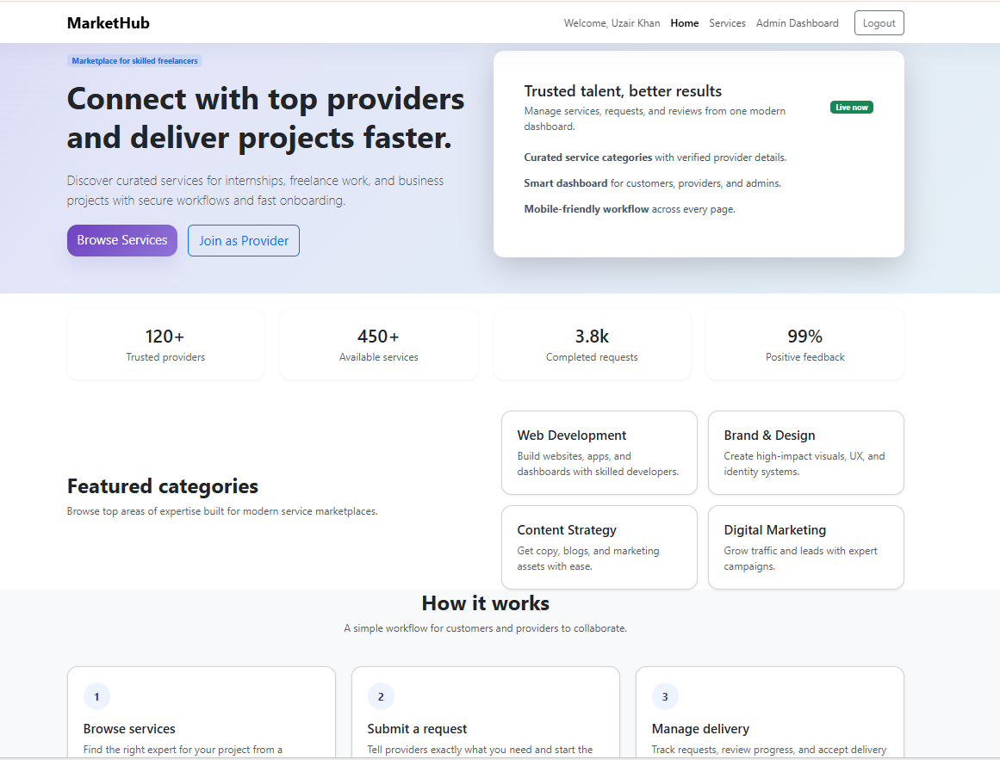
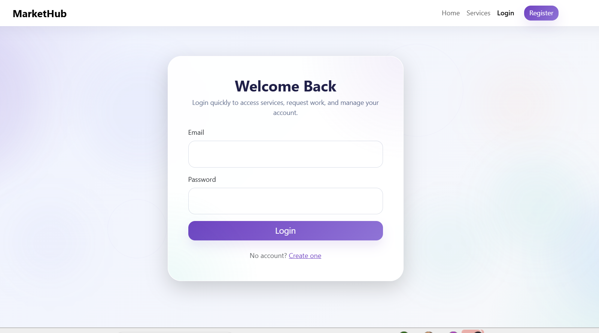
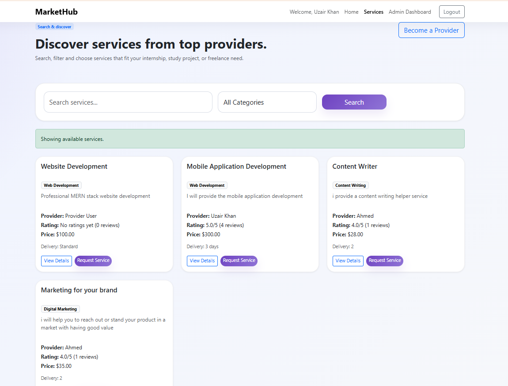
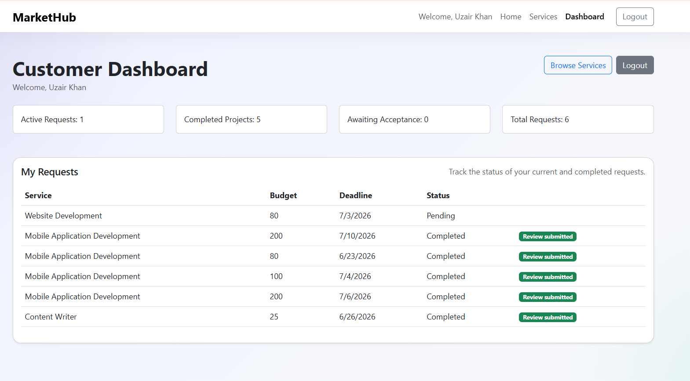
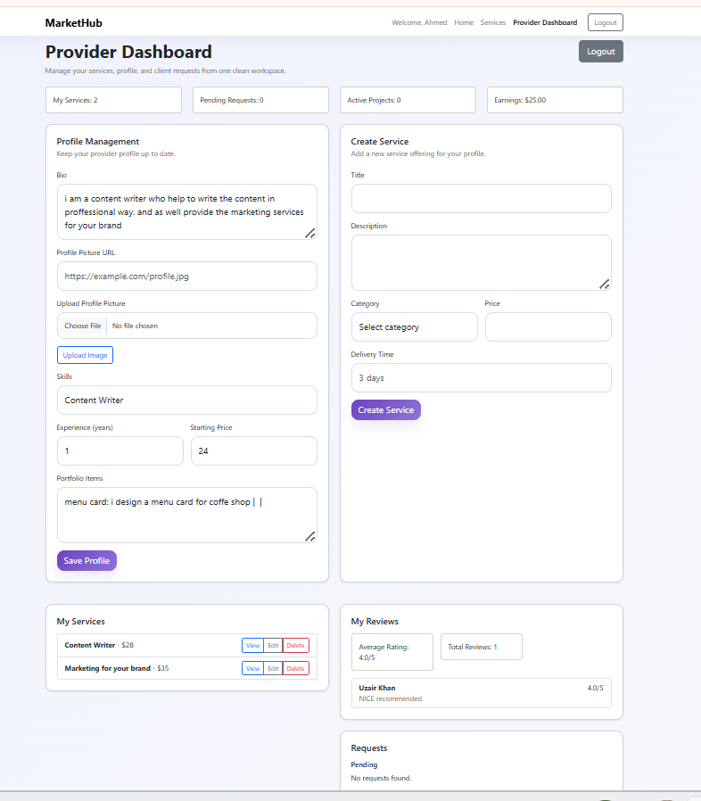
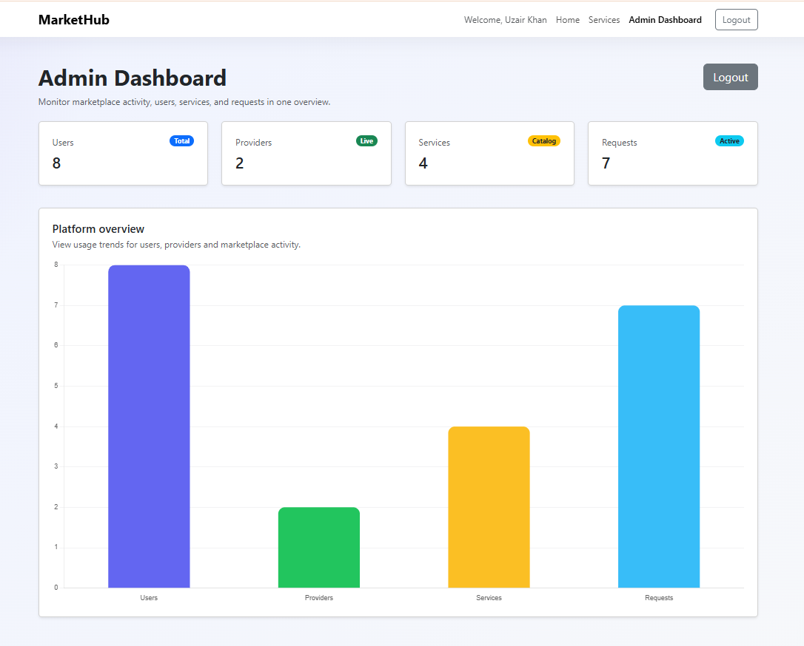

# 🏪 Multi-Vendor Marketplace Platform

A full-stack marketplace platform connecting customers with service providers. Customers browse services, submit project requests, and leave reviews. Providers manage services and handle client projects. Administrators monitor platform statistics through a dedicated dashboard.

---

## 🌐 Live Demo
**[https://multi-vendor-market-place.onrender.com](https://multi-vendor-market-place.onrender.com/)**

## 📚 GitHub Repository
**[https://github.com/Uzairkahn/Multi-Vendor-Market-place](https://github.com/Uzairkahn/Multi-Vendor-Market-place)**

---

## Features

### ✨ Customer Features

- User Registration & Login
- Browse Available Services
- Search and Filter Services
- Submit Service Requests
- Track Project Status
- Submit Reviews and Ratings
- Customer Dashboard

### Provider Features

- User Registration & Login
- Provider Profile Management
- Profile Picture Upload (Cloudinary)
- Create Services
- Edit Services
- Delete Services
- Manage Client Requests
- Update Project Status
- View Reviews & Ratings
- Provider Dashboard

### Admin Features

- User Statistics
- Provider Statistics
- Service Statistics
- Request Statistics
- Admin Dashboard

### Security Features

- JWT Authentication
- Role-Based Access Control (Customer, Provider, Admin)
- Protected API Routes
- Authorization Middleware
- Secure Password Hashing

## 🎨 Screenshots

### 🏠 Home Screen


### 🔐 Login Screen


### 📝 Sign Up Screen


### 🛍️ Services Dashboard


### 👤 Customer Dashboard


### 🔧 Provider Dashboard


### 📊 Admin Dashboard


---

## 🛠️ Technology Stack

### Frontend
- **HTML5** — Semantic markup
- **CSS3** — Modern styling with animations
- **JavaScript (ES6)** — Dynamic interactions and validation
- **Bootstrap 5** — Responsive UI framework
- **Chart.js** — Dashboard analytics & visualization

### Backend
- **Node.js** — JavaScript runtime
- **Express.js** — Web framework
- **Mongoose** — MongoDB object modeling

### Database
- **MongoDB Atlas** — Cloud NoSQL database

### Authentication
- **JWT (JSON Web Tokens)** — Stateless authentication
- **bcryptjs** — Password hashing

### Cloud Services
- **Cloudinary** — Image upload & storage

### Deployment
- **Render** — Cloud hosting platform

---

## 🎯 System Roles

### Customer
Customers can browse services, request projects, track progress, and submit reviews.

### Provider
Providers can manage their services, accept client requests, update project status, and maintain their professional profile.

### Admin
Administrators can monitor platform statistics including users, services, providers, and project requests.

---

## 🔄 Project Workflow


## Installation Guide

### Prerequisites
- Node.js (v18 or higher)
- npm or yarn
- MongoDB Atlas account
- Cloudinary account

### Step 1: Clone Repository

```bash
git clone https://github.com/Uzairkahn/Multi-Vendor-Market-place.git
cd Multi-Vendor-Market-place
```

### Step 2: Install Backend Dependencies

```bash
cd backend
npm install
```

### Step 3: Configure Environment Variables

Create a `backend/.env` file:

```env
MONGO_URI=mongodb+srv://<username>:<password>@<cluster-url>/<database-name>
JWT_SECRET=your_jwt_secret_key
PORT=5000
CLOUDINARY_CLOUD_NAME=your_cloudinary_cloud_name
CLOUDINARY_API_KEY=your_cloudinary_api_key
CLOUDINARY_API_SECRET=your_cloudinary_api_secret
```

### Step 4: Start Backend Server

```bash
npm run dev
```

The application will run at: **http://localhost:5000**

> **Note:** Open the app through the Express server, not via `file:///`. The frontend relies on `/api/...` calls and needs the same origin.

---

## �📡 API Endpoints

### Health

- `GET /api/health` — API health check

### Auth

- `POST /api/auth/register` — Register a customer or provider
- `POST /api/auth/login` — Login and receive a JWT

### Provider Profiles

- `GET /api/provider-profiles/me` — Get the logged-in provider profile
- `POST /api/provider-profiles/me/photo` — Upload profile picture for the logged-in provider
- `POST /api/provider-profiles` — Create/update provider profile
- `PUT /api/provider-profiles/me` — Update the logged-in provider profile
- `GET /api/provider-profiles/:providerId` — Get public provider profile by provider ID

### Services

- `GET /api/services` — List services, supports optional `search` and `category`
- `POST /api/services` — Create a service as provider/admin
- `GET /api/services/:id` — Get service details
- `PUT /api/services/:id` — Update a service as owner/admin
- `DELETE /api/services/:id` — Delete a service as owner/admin

### Requests

- `POST /api/requests` — Create a service request
- `GET /api/requests` — Get requests for the current user
- `PUT /api/requests/:id/status` — Update request status

### Reviews

- `POST /api/reviews` — Add a provider review
- `GET /api/reviews/provider/:id` — Get provider reviews and rating summary

### Admin

- `GET /api/admin/stats` — Get platform statistics for admin users

## Database Schema Summary

- `User` — name, email, password, role
- `ProviderProfile` — user, profile photo, bio, skills, experience, pricing, portfolio items
- `Service` — title, description, category, price, delivery time, provider reference
- `Request` — customer, service, requirements, budget, deadline, status
- `Review` — provider, customer, rating, feedback

## Project Status

✅ Authentication System Completed

✅ Customer Dashboard Completed

✅ Provider Dashboard Completed

✅ Admin Dashboard Completed

✅ Service Management Completed

✅ Request Management Completed

✅ Reviews & Ratings Completed

✅ MongoDB Atlas Integration Completed

✅ Cloudinary Integration Completed

✅ Role-Based Access Control Completed

---

## 📈 Future Enhancements

- Real-time notifications and chat
- Payment gateway integration
- Advanced analytics and reporting
- Service recommendation engine
- Mobile-friendly PWA experience
- Email notifications system
- Multi-language support

---

## 🤝 Contributing

Contributions are welcome! Please:
1. Fork the repository
2. Create a feature branch (`git checkout -b feature/amazing-feature`)
3. Commit changes (`git commit -m 'Add amazing feature'`)
4. Push to branch (`git push origin feature/amazing-feature`)
5. Open a Pull Request

---

## 👨‍💼 Author

**Uzair Khan**

- **Education**: BS Computer Science, Sukkur IBA University
- **GitHub**: [https://github.com/Uzairkahn](https://github.com/Uzairkahn)
- **LinkedIn**: [https://www.linkedin.com/in/uzair-khan-616048385/](https://www.linkedin.com/in/uzair-khan-616048385/)

---

## 📧 Support

For questions or issues, please open an issue on GitHub or contact via LinkedIn.

---

## 🎉 Acknowledgments

- Bootstrap 5 for responsive UI
- Chart.js for analytics visualization
- MongoDB Atlas for reliable database hosting
- Cloudinary for image management
- Render for seamless deployment

---

**Made with ❤️ by Uzair Khan**
